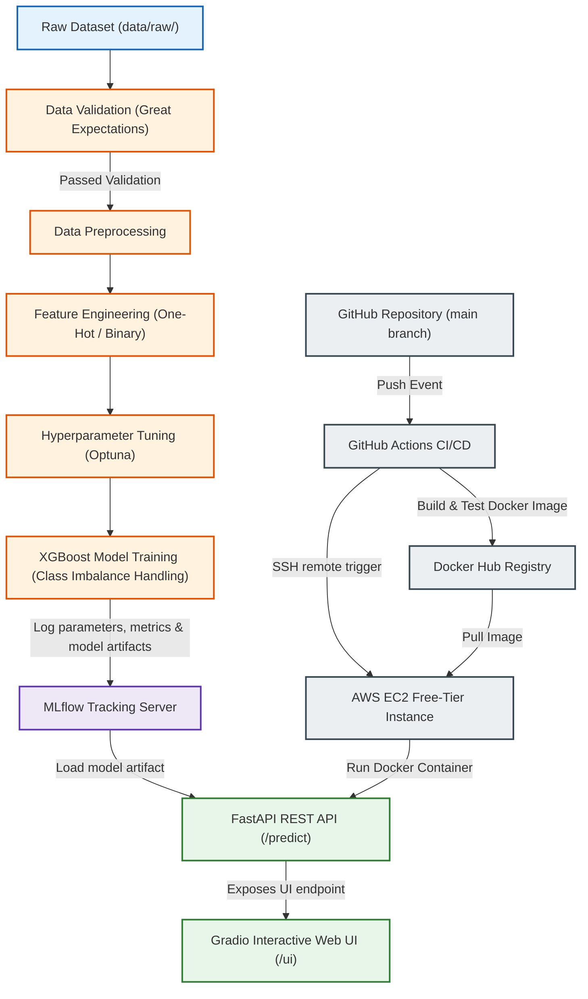

# 🔮 Production-Ready Telco Customer Churn Prediction System

[](https://www.python.org/downloads/)
[](https://fastapi.tiangolo.com/)
[](https://gradio.app/)
[](https://xgboost.readthedocs.io/)
[](https://mlflow.org/)
[](https://www.docker.com/)
[](https://aws.amazon.com/ec2/)

An end-to-end productionized machine learning system for predicting customer churn. This project moves away from chaotic notebooks, establishing a modular MLOps architecture featuring rigorous **data quality checks**, **hyperparameter optimization**, **experiment tracking**, **containerized serving**, and a **CI/CD pipeline** deployed to a free-tier **AWS EC2** instance.

---

## 🏗️ System Architecture

The workflow below details the end-to-end data ingestion, validation, model training, tracking, serving, and deployment lifecycle:



---

## 🌟 Highlights for Recruiters

* **Strict Data Quality Enforcement**: Employs **Great Expectations** to programmatically validate raw schema, values, range boundaries, and non-null constraints before kicking off preprocessing.
* **Tackling Class Imbalance**: Addresses churn minority class representation dynamically using XGBoost's `scale_pos_weight` parameter computed directly from training set distributions.
* **Hyperparameter Search**: Automates optimization trials using **Optuna** to maximize recall and F1-score.
* **Training/Serving Feature Alignment**: Resolves train/serve skew by mapping binary columns deterministically, one-hot encoding categorical variables, and enforcing feature schema alignment dynamically during inference (using `feature_columns.txt`).
* **Interactive Exploration & API Serving**: Provides both a production-ready **FastAPI** REST API and a highly interactive **Gradio 6.0** web dashboard mounted under the `/ui` route.
* **AWS Free Tier Optimized**: Avoids expensive AWS services by targeting EC2 Freetier (`t2.micro` or `t3.micro`) running Docker, connected via a secure SSH-based deployment workflow in GitHub Actions.

---

## 📁 Repository Structure

```
├── .github/workflows/          # CI/CD pipelines
│   └── deploy.yml              # Automated build, test, and push-to-EC2 workflow
├── data/                       # Dataset store (ignored except for raw dataset)
│   ├── raw/                    # Raw source dataset
│   └── processed/              # Feature engineered output data
├── notebooks/                  # Exploratory Data Analysis & experiments
├── scripts/                    # Runnable validation and model execution scripts
│   ├── prepare_processed_data.py  # Preprocessing and feature engineering step
│   ├── run_pipeline.py            # Main training pipeline
│   ├── test_fastapi.py            # Local endpoint integration verification test
│   ├── test_pipeline_phase1_data_features.py
│   └── test_pipeline_phase2_modeling.py
├── src/                        # Core source codebase
│   ├── app/                    # FastAPI and Gradio serving app
│   ├── data/                   # Data load routines
│   ├── features/               # Feature engineering library
│   ├── models/                 # Model training and optimization modules
│   └── serving/                # Serving-time inference logic and local models
├── dockerfile                  # Multi-stage Docker deployment config
└── requirements.txt            # Python dependencies (pinned for stability)
```

---

## ⚙️ Local Setup

### Prerequisite
* Python 3.11 or 3.12 installed.

### 1. Set Up Virtual Environment
```bash
# Clone the repository
git clone <your-repo-url>
cd Telco-Customer-Churn-ML

# Create virtual environment
python -m venv .venv

# Activate virtual environment
# On Windows:
.venv\Scripts\activate
# On Linux/macOS:
source .venv/bin/activate

# Upgrade pip and install dependencies
pip install --upgrade pip
pip install -r requirements.txt
```

### 2. Verify Pipeline Stages
```bash
# Run data preprocessing and feature engineering
python -X utf8 scripts/prepare_processed_data.py

# Test Data Loading and Validation (Phase 1)
python -X utf8 scripts/test_pipeline_phase1_data_features.py

# Test Model Training and Parameter Tuning (Phase 2)
python -X utf8 scripts/test_pipeline_phase2_modeling.py
```

### 3. Run FastAPI and Gradio UI
```bash
python -X utf8 -m uvicorn src.app.main:app --host 0.0.0.0 --port 8000
```
* **API Documentation**: [http://localhost:8000/docs](http://localhost:8000/docs)
* **Gradio Web Interface**: [http://localhost:8000/ui](http://localhost:8000/ui)

---

## 🐳 Dockerization

### 1. Build the Docker Image
```bash
docker build -t telco-customer-churn-app .
```

### 2. Run the Container
```bash
docker run -p 8000:8000 telco-customer-churn-app
```
Access the application at `http://localhost:8000/ui`.

---

## 🚀 AWS EC2 Free-Tier CI/CD Deployment

The project is configured for automated CI/CD deployment on pushes to the `main` branch. 

### Deployment Prerequisites

To deploy this project to AWS EC2 for free:
1. **Launch an EC2 Instance**: Use Ubuntu Server 22.04 LTS on a `t2.micro` or `t3.micro` instance (eligible for Free Tier).
2. **Configure Security Groups**: Expose port `22` (SSH) and port `8000` (FastAPI/Gradio) to public traffic.
3. **Install Docker on EC2**:
   ```bash
   sudo apt-get update
   sudo apt-get install -y docker.io
   sudo systemctl start docker
   sudo systemctl enable docker
   sudo usermod -aG docker $USER
   ```
4. **GitHub Secrets Configuration**: Add these secrets in your GitHub repository's Settings > Secrets and Variables > Actions:
   * `DOCKERHUB_USERNAME`: Your Docker Hub username.
   * `DOCKERHUB_TOKEN`: Your Docker Hub personal access token.
   * `EC2_HOST`: The Public IP or DNS of your EC2 instance.
   * `EC2_USERNAME`: Usually `ubuntu`.
   * `EC2_SSH_KEY`: The contents of your private SSH key (`.pem` file) used to access the instance.

For step-by-step instructions on AWS setup and secrets configuration, refer to the [AWS EC2 Deployment Guide](file:///C:/Users/HP/.gemini/antigravity/brain/26a2ccb5-ad19-4045-8565-073da94b4fee/aws_ec2_deployment_guide.md).